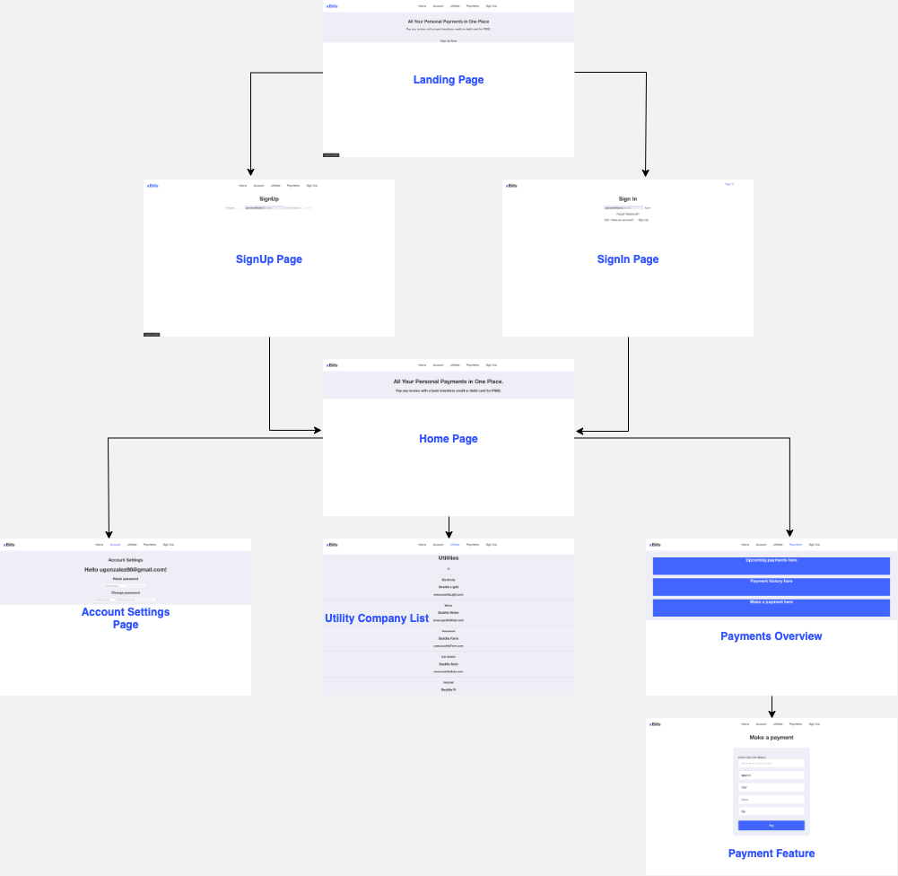

## eBills
##### by _**Uriel Gonzalez**_

### Description
I wanted to create a model for a financial website in React.js. Something essential that I would use in real life on a daily basis. With that in mind I decided to create a website where users can add or select a utility company and pay bills.

On eBills, users can:
```
* Log In/Off, Sign Up and reset their password. Authentication developed with Firebase.
* Pick a pre existing (hard coded/fake) utility company
* Add/Edit a company
* Set up a payment
* Make a payment. The code with the capability is done (see the payment form js file under Components), but I need to go through the authorization process and other steps at SquareUp, which is the platform I used.
* See their payment history
* Project in progress, more functions and better styling coming soon.
```

### Component Planning


### Installation
```
In command line, run the following:
1.Clone this repository
    $ git clone https://github.com/Ugonz86/capstone2.git
2. Install dependencies
    $ npm install
3. Run program
    $ npm run start
4. Open webpage
    $ In your browser, this should load: http://localhost:3000/
5. You may skip these steps and click on the following link:
```

### Known Bugs
* The code for the payments part is broken due to technical issues on my end but it will be fixed and committed shortly.

### Technologies Used
* Git, GitHub, ReactJS, Webpack, Firebase & SquareUp.

### Support and Contact Details
* _ugonzalez86@gmail.com_

### Licence
Copyright © 2020
MIT Licence